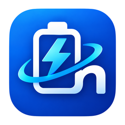

#  BatNex 🔋 (Electron)

A simple Electron desktop app for Windows that shows the **battery percentage of
your Bluetooth devices** — in a window and as **live system-tray icons**
(one icon per device, each drawn with its battery % and a device-type color).

No Rust, no native Node modules: the UI is HTML/CSS/JS, Bluetooth is read via a
small Python script ([bleak](https://github.com/hbldh/bleak)), and tray icons
are PNGs generated in pure JS.

## How it works

- `scripts/bt_battery.py` reads the paired-device list from the Windows Bluetooth
  registry, checks each device's **live connection state** via WinRT
  (`BluetoothLEDevice` / `BluetoothDevice`), keeps only devices that are
  **currently connected**, and reads the standard **BLE Battery Service**
  (Battery Level `0x2A19`) for those — printing a JSON report. No admin rights needed.
  `--list` skips battery reads for a fast (~1s) connected-devices check.
  Phase timings print to stderr, so a hanging phase is easy to spot.
- `lib/bluetooth.js` runs that script and parses the output.
- `main.js` (Electron main process) auto-detects connections: a cheap
  connected-list poll runs every 15s and battery reads happen only when
  the device set changes (or while some batteries are still unknown, retried
  every 60s). Device *type* comes from the scanner too (name + Bluetooth
  Class of Device), and each device that reports a battery level gets a tray
  icon showing the device glyph in its level color (100–80 green, 79–50
  blue, 49–20 yellow, 19–0 red), maximized to fill the icon. Devices without
  battery info appear in the window only — no tray icon. Watches, laptops,
  TVs, printers and styluses are not tracked and never listed.
  In the window, hovering a truncated name shows it in full, and the type
  label is a custom dropdown matching the UI: picking a type overrides
  auto-detection for that device (persisted in the app data folder,
  applied to window + tray).
  No manual refresh needed — though the
  header button and tray menu keep one. Right-click any tray icon for
  Show / Refresh / **Run at startup** (checkbox) / Quit — auto-started
  launches begin hidden in the tray.
- The UI is [daisyUI](https://daisyui.com/) (compiled locally with Tailwind,
  no CDN) with [heroicons](https://heroicons.com/) for window chrome and
  custom line-style device glyphs, bundled by `scripts/build_icons.js`.
  Rebuild assets with `npm run icons` and `npm run css`. The window is
  frameless with a custom title bar (minimize/close only) and a fixed size.

> **Battery sources:** Windows itself tracks connected-device battery (from HFP
> reports and its own BLE reads) in the system device properties — the same
> value Settings shows — and BatNex reads that first (instant, no extra
> connections). Devices the OS cache doesn't cover fall back to a direct BLE
> Battery Service read. A device with neither appears as connected with `n/a`.

## Prerequisites (development)

- Windows 10/11 with Bluetooth switched on (devices paired, powered, nearby)
- [Node.js](https://nodejs.org/) 18+
- Python 3.10+ with the `bleak` package (only needed for development —
  the installer ships its own private Python runtime, see below):
  ```cmd
  cmd /c "python -m pip install bleak"
  ```

> PowerShell blocks `npm`/`npx` on some machines (`running scripts is disabled`).
> All commands below use `cmd /c "..."` to avoid that.

## Run it

```cmd
cmd /c "npm install"
cmd /c "npm start"
```

## Build a Windows installer

```cmd
cmd /c "npm run dist"
```

Find the setup `.exe` under `dist/`. End users need nothing except
Bluetooth — the installer bundles a private Python 3.12 + `bleak` runtime
(`vendor/python`, fetched once with `python scripts/fetch_python.py`),
so no system Python is required on their machines.

## Publish a release on GitHub

Pushing a version tag builds the installer in the cloud and attaches it
to a GitHub Release automatically (see `.github/workflows/release.yml`):

```cmd
cmd /c "git tag v0.1.0 & git push origin v0.1.0"
```

Keep the tag and the `version` in `package.json` in sync. The workflow
regenerates everything ignored locally (`node_modules/`, `vendor/`,
`dist/`) on a `windows-latest` runner. Note the installer is unsigned,
so Windows SmartScreen will show an "unknown publisher" prompt —
recipients choose "More info → Run anyway" (a code-signing certificate
removes this).

## Project layout

```
main.js               # windows, tray manager, IPC, background refresh
preload.js            # safe renderer bridge (context isolation on)
renderer/             # UI: index.html, renderer.js, styles.css
lib/
  bluetooth.js        # spawns the Python scanner, parses JSON
  classify.js         # device-type detection (icon + color)
  trayIcon.js         # 64x64 tray icon renderer (pure JS PNG)
scripts/
  bt_battery.py       # bleak BLE scan + Battery Service reads
  convert_logo.py       # favicon.ico -> app icons (transparency fix included)
assets/               # icon.png / icon.ico
```

## Troubleshooting

| Symptom | Fix |
|---|---|
| `Could not start Python` | Install Python 3.10+ and tick “Add to PATH”. |
| `No module named 'bleak'` / scanner error | Run `python -m pip install bleak`. |
| Scan times out / nothing updates | Watch the `[scanner] [bt] …` lines in the terminal — they show per-phase timings (`paired` → `status check` → `discovery` → `battery reads`) so you can see exactly which phase hangs. A full scan is normally under ~20s. |
| Empty list | Only **connected** devices are shown — connect one in Windows Settings → Bluetooth & devices. It appears automatically within ~15s. |
| Device shows but battery is `n/a` | Check the terminal for the `[battery] <name>: <reason>` line: it tells you whether the GATT connect failed, the device has no Battery Service (0x180F), or the read was rejected. Share that line when reporting the issue. |
| `npm` fails in PowerShell | Use `cmd /c "npm ..."` instead. |
